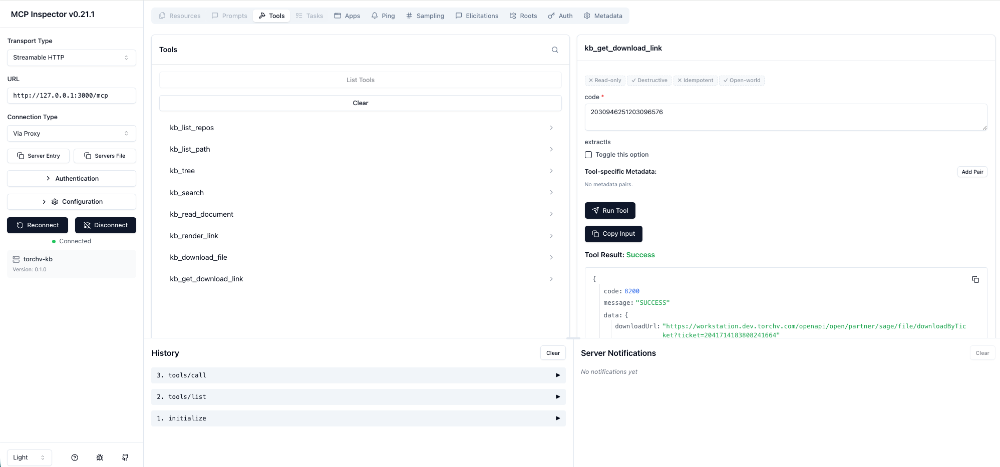

# `@torchv/ais-mcp`

[English](README.md) | [中文](README_CN.md)

[](https://opensource.org/licenses/Apache-2.0)  

🚀 **TorchV AIS Knowledge Base MCP Server**

A production-ready MCP server that enables **read / write / edit / file transfer** operations directly on the AIS enterprise knowledge base.


---

## ✨ Features

* 📚 Unified access to AIS knowledge base
* 🛠️ Full MCP toolchain (read / write / management)
* ⚡ One-command startup via `npx`
* 🔌 Supports both **STDIO** and **HTTP (streamable)** transports
* 🔐 Fine-grained permission control (`readonly / write / admin`)

---

## 🚀 Installation & Run

```bash
npx -y @torchv/ais-mcp
```

---

## 🔑 Required Configuration

Before starting, set the following environment variables:

```bash
export KB_EXECUTE_URL="https://bot.torchv.com"
export KB_TOKEN="your-token"
```

---

### 🌐 How to get `KB_EXECUTE_URL`

📌 Steps:

1. Open your AIS instance
2. Copy the site origin from the browser address bar

👉 Example:

```text
https://bot.torchv.com
```

---

### 🔐 How to get `KB_TOKEN`

**Recommended:**

```
AIS → Admin Center → API Keys → Create Key
```

**Temporary (not recommended for production):**

```
Browser DevTools → Network → Inspect request → Copy token
```

---

## ⚙️ Optional Configuration

```bash
export KB_MODE="readonly"   # readonly | write | admin
export KB_TIMEOUT_SECONDS="30"
export KB_DEFAULT_REPO_CODE="TEAM_DOCS"
export KB_EXTRA_HEADERS_JSON='{"x-foo":"bar"}'
```

---

### 🛡️ Permission Levels

* 🟢 `readonly` → Read-only access
* 🟡 `write` → Allows write / upload / publish
* 🔴 `admin` → Full control (move / delete)

---

## 🧩 Run Modes

### 🖥️ STDIO Mode (Local MCP Client)

```bash
npm run build
node dist/cli.js
```

or:

```bash
npm run dev
npm run start
```

---

### 🌍 Streamable HTTP Mode

```bash
npm run build
node dist/cli.js \
  --transport streamable-http \
  --host 127.0.0.1 \
  --port 3000 \
  --path /mcp
```

or:

```bash
npm run dev:http
npm run start:http
```

📌 Parameters:

```bash
--transport streamable-http
--host 127.0.0.1
--port 3000
--path /mcp
```

---

## 🔌 Claude / Codex Configuration

### STDIO

```json
{
  "mcpServers": {
    "ais": {
      "command": "npx",
      "args": ["-y", "@torchv/ais-mcp"],
      "env": {
        "KB_EXECUTE_URL": "https://your-ais-domain",
        "KB_TOKEN": "your-token",
        "KB_MODE": "readonly"
      }
    }
  }
}
```

---

### HTTP Mode

```json
{
  "mcpServers": {
    "ais-http": {
      "type": "streamable-http",
      "url": "http://127.0.0.1:3000/mcp"
    }
  }
}
```

---

## 🛠️ Tooling Overview

### 📖 Read-only

* `kb_list_repos`
* `kb_list_path`
* `kb_tree`
* `kb_search`
* `kb_read_document`
* `kb_render_link`
* `kb_download_file`
* `kb_get_download_link`

---

### ✏️ Write

* `kb_write_document`
* `kb_patch_document`
* `kb_create_directory`
* `kb_copy_document`
* `kb_publish_document`
* `kb_upload_file`

---

### 🔧 Admin

* `kb_move_document`
* `kb_delete_document`

---

## 🧠 About AIS

AIS is TorchV’s core product — not just a traditional knowledge base, but:

> 🧠 **An Enterprise AI Knowledge Engine**

### Core Capabilities

* 🔄 Transform scattered data → structured knowledge
* 🔍 Searchable
* 🧩 Governable
* ⚡ Composable
* 📈 Optimizable

---

## 🎁 Try AIS

📲 Contact us (CEO WeChat):


